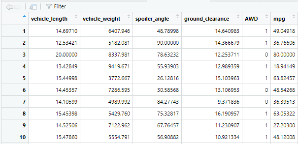

# MechaCar_Statistical_Analysis
## Linear Regression to Predict MPG

(5 points) Here are the first 10 rows of the 50 rows of MechaCar_mpg.csv read into a dataframe:

Study Design: MechaCar vs Competition
(5 points) To test the MechaCar against its competition, we can test the fuel economy of the MechaCar against the fuel economy ratings of comparable vehicles by other manufacturers.

(5 points)

The null hyphothesis H0 is that there is no significant difference in fuel economy ratings of MechaCar models against fuel economy ratings of the other manufacturers' vehicles. Any such differences, if determined by statistical analysis, are not significant and can be explained by random chance.

The alternate hypothesis Ha is that there is a statistically significant difference in fuel economy ratings of MechaCar models against fuel economy ratings of the other manufacturers' comparable vehicles.

(5 points)

To gain a competitive advantage, we want to show that MechaCar models provide superior fuel economy ratings over comparable non-MechaCar vehicles. Thus, we can perform a one-tailed t-test with p-value, or probability value, equal to 0.95.

(5 points)

We will obtain fuel economy data for the competitors' comparable vehicles and run statistical tests against fuel economy data of MechaCar vehicles. If we calculate a p-value that is smaller than 0.95, we would state that there is sufficient statistical evidence that our null hypothesis is not true. Thus, we would use these findings to reject the null hypothesis and generate the conclusion that MechaCar models offer superior fuel economy over the vehicles of its competitors.
