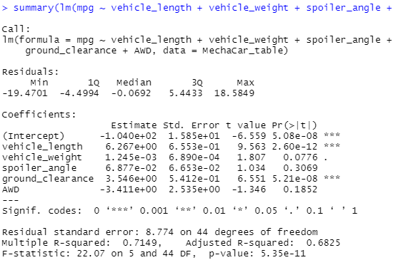

# MechaCar_Statistical_Analysis
## Linear Regression to Predict MPG

(5 points) Here are the first 10 rows of the 50 rows of MechaCar_mpg.csv read into a dataframe:

(10 points) Linear regression on all six variables (five are independent and MPG is dependent):
> lm(mpg ~ vehicle_length + vehicle_weight + spoiler_angle + ground_clearance + AWD, data=MechaCar_table) #generate multiple linear regression model

Call:
lm(formula = mpg ~ vehicle_length + vehicle_weight + spoiler_angle + ground_clearance + AWD, data = MechaCar_table)

Coefficients:
     
     (Intercept)    vehicle_length    vehicle_weight     spoiler_angle  ground_clearance               AWD
      
      -1.040e+02         6.267e+00         1.245e-03         6.877e-02         3.546e+00         -3.411e+00

(10 points) Statistical summary with intended p-values:

(5 points) Questions addressed in Deliverable 1 Requirements
Which variables/coefficients provided a non-random amount of variance to the mpg values in the dataset?

As explained in the module, each Pr(>|t|) value in the summary output represents the probability that each coefficient contributes a random amount of variance to the linear model. According to the results, vehicle length and ground clearance (as well as intercept) are statistically unlikely to provide random amounts of variance to the linear model. In other words the vehicle length and ground clearance have a significant impact on mpg. 

The slope is not considered to be zero, as the multiple R-squared value is 0.7149 while the p-value remains significant. However, since multiple linear regression models use multiple variables and dimensions, they are almost impossible to plot and visualize.

This model does appear to predict mpg of MechaCar prototypes effectively. The R-squared value of 0.7149 is relatively high while the p-value remains significant.

Is the slope of the linear model considered to be zero? Why or why not?
Does this linear model predict mpg of MechaCar prototypes effectively? Why or why not?
Study Design: MechaCar vs Competition
(5 points) To test the MechaCar against its competition, we can test the fuel economy of the MechaCar against the fuel economy ratings of comparable vehicles by other manufacturers.

(5 points)

The null hyphothesis H0 is that there is no significant difference in fuel economy ratings of MechaCar models against fuel economy ratings of the other manufacturers' vehicles. Any such differences, if determined by statistical analysis, are not significant and can be explained by random chance.

The alternate hypothesis Ha is that there is a statistically significant difference in fuel economy ratings of MechaCar models against fuel economy ratings of the other manufacturers' comparable vehicles.

(5 points)

To gain a competitive advantage, we want to show that MechaCar models provide superior fuel economy ratings over comparable non-MechaCar vehicles. Thus, we can perform a one-tailed t-test with p-value, or probability value, equal to 0.95.

(5 points)

We will obtain fuel economy data for the competitors' comparable vehicles and run statistical tests against fuel economy data of MechaCar vehicles. If we calculate a p-value that is smaller than 0.95, we would state that there is sufficient statistical evidence that our null hypothesis is not true. Thus, we would use these findings to reject the null hypothesis and generate the conclusion that MechaCar models offer superior fuel economy over the vehicles of its competitors.
